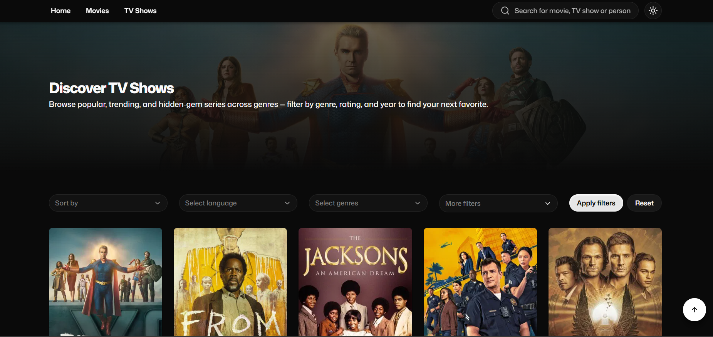

# Movies

A modern movie and TV discovery app for exploring movies, shows, and the people behind them. Browse with advanced filters and fast search, then dive into detailed pages featuring cast, crew, trailers, ratings, and more. Built with Next.js, TypeScript, Tailwind CSS, and the TMDB API.



## ✨ Core Features

- **Explorer (Movies & TV)**  
  Browse movies or TV shows with various filter options and infinite scroll.

- **Movie & TV Details**  
  Access detailed information for each title, including ratings, genres, release information, cast and crew, trailers, and curated content carousels for related media.

- **Person Details**  
  View biographies and profile info, plus filterable credits grouped by acting/production roles.

- **Debounced Search Dialog**  
  Search across movies, TV shows, and people from a centralized search dialog with a combobox with debounced queries.

## 📦 Installation & Setup

All movie, TV show, and person data is provided by TMDB. To run the application locally, you'll need a TMDB Read Access Token (Bearer Token).

**1. Clone the repository**

```bash
git clone https://github.com/narek-24/Movies.git
cd movies
```

**2. Install dependencies**

```bash
npm install
```

**3. Configure environment variables**

Create a `.env` file in the project root and add your TMDB bearer token:

```env
API_TOKEN=your_tmdb_bearer_token
```

**4. Run the development server**

```bash
npm run dev
```

Open http://localhost:3000 in your browser.
